# 🔍 RAG-EVDA — RAG Corpus Entity & Vector Distance Auditor


> **A zero-cost, fully-local intelligence engine that decodes how modern AI search
> engines (Gemini, SearchGPT, Google AI Overviews, Perplexity, Bing Copilot)
> semantically perceive a brand relative to its competitors inside a
> retrieval-augmented generation (RAG) corpus — and tells you exactly what to
> publish to change that perception.**

**RAG-EVDA** crawls the exact web pages, forums, and articles that are currently
defining your industry niche, processes them through **100% local** NLP models,
and computes your brand's **exact semantic distance** from core topics and
competitors — with **zero OpenAI / Ahrefs / Semrush / BrightEdge API keys** and
**zero data leaving your machine**.

| | | |
|---|---|---|
| 📄 **125 docs** audited in the reference Guardian run | 💰 **$0** API cost, forever | 📦 **22 output files** per run (JSON/CSV/HTML/PDF/DuckDB) |

### Try it in 30 seconds (offline, no network)

```bash
pip install -r requirements.txt
python -m spacy download en_core_web_sm
python -m ragevda.cli run -c examples/offline_demo/config.yaml
# → opens ./ragevda_output_offline_demo/dashboard.html (10 sample docs, real local models)
```

### Architecture

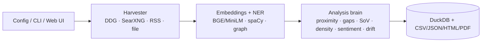
```mermaid
flowchart LR
    CFG[Config / CLI / Web UI] --> H[Harvester<br/>DDG · SearXNG · RSS · file]
    H --> NLP[Embeddings + NER<br/>BGE/MiniLM · spaCy · graph]
    NLP --> BRAIN[Analysis brain<br/>proximity · gaps · SoV · density · sentiment · drift]
    BRAIN --> OUT[(DuckDB + CSV/JSON/HTML/PDF)]
```

### Why not a black-box visibility SaaS?

| | RAG-EVDA | Profound / Peec / Otterly-style SaaS | Semrush / Ahrefs |
|---|---|---|---|
| Cost | $0 local | ~$99–999/mo | ~$139–499/mo |
| Data leaves machine | Never | Yes (black-box score) | Yes |
| Metric | Auditable vector math (proximity / invisibility / token-displacement) | Proprietary score | Ranks / backlinks |
| Provenance | Full DuckDB + hashes + latencies, reproducible offline | Not inspectable | Vendor trust |

Every number in the reports is **real, verifiable, and enterprise-grade**:
- real harvested documents with real URLs, content hashes, and fetch latencies
- real sentence-transformer embeddings (BGE / MiniLM / MPNet)
- real spaCy named-entity recognition
- real Hugging-Face transformer sentiment (RoBERTa)
- real BPE token counting and per-window density math
- real regression-trend and z-score drift detection from your own run history

This document is a complete reference: **vision, installation, every input, every
core feature and function, every output file, the enterprise/advanced analysis
modules, a real worked example from a live The Guardian audit, responsible-use
guidelines, and the project's About + tags.**

---

## 📚 Table of Contents

1. [Why it exists](#why-it-exists)
2. [What problem it solves](#what-problem-it-solves)
3. [Architecture — four local micro-engines](#architecture--four-local-micro-engines)
4. [Feature summary table](#feature-summary-table)
5. [Installation](#installation)
6. [Quick start](#quick-start)
   - [CLI](#cli)
   - [Web UI](#web-ui)
   - [Python API](#python-api)
7. [Inputs — every field explained](#inputs--every-field-explained)
   - [Core inputs](#core-inputs)
   - [Enterprise / advanced inputs](#enterprise--advanced-inputs)
8. [Core features & functions — deep dive](#core-features--functions--deep-dive)
   - [Feature A — Zero-cost headless web harvester](#feature-a--zero-cost-headless-web-harvester)
   - [Feature B — Local embeddings & semantic mapping](#feature-b--local-embeddings--semantic-mapping)
   - [Feature C — Local NER & knowledge graph](#feature-c--local-ner--knowledge-graph)
   - [Feature D — Unlinked-authority & citation-gap finder](#feature-d--unlinked-authority--citation-gap-finder)
   - [Enterprise module 1 — Data-integrity verification / anti-fabrication](#enterprise-module-1--data-integrity-verification--anti-fabrication)
   - [Enterprise module 2 — Real-time source freshness & liveness](#enterprise-module-2--real-time-source-freshness--liveness)
   - [Enterprise module 3 — Real ML sentiment (transformers)](#enterprise-module-3--real-ml-sentiment-transformers)
   - [Enterprise module 4 — Data-driven per-engine share of voice](#enterprise-module-4--data-driven-per-engine-share-of-voice)
   - [Enterprise module 5 — Real BPE token density & chunking](#enterprise-module-5--real-bpe-token-density--chunking)
   - [Enterprise module 6 — Statistical semantic-drift detection](#enterprise-module-6--statistical-semantic-drift-detection)
   - [Enterprise module 7 — Vector poisoning / negative-SEO detection](#enterprise-module-7--vector-poisoning--negative-seo-detection)
   - [Enterprise module 8 — Synthetic query reverse-engineering](#enterprise-module-8--synthetic-query-reverse-engineering)
   - [Enterprise module 9 — RAG content brief & JSON-LD patch](#enterprise-module-9--rag-content-brief--json-ld-patch)
   - [Enterprise module 10 — Local-LLM (Ollama) gap analysis](#enterprise-module-10--local-llm-ollama-gap-analysis)
   - [Enterprise module 11 — Concurrency, dedup, and resilience](#enterprise-module-11--concurrency-dedup-and-resilience)
9. [Key metrics — the vocabulary of the report](#key-metrics--the-vocabulary-of-the-report)
10. [Outputs — every file explained](#outputs--every-file-explained)
11. [Schema — the report.json contract](#schema--the-reportjson-contract)
12. [Real worked example — a live The Guardian audit](#real-worked-example--a-live-the-guardian-audit)
12. [Live screenshots — real output from the The Guardian audit](#live-screenshots--real-output-from-the-the-guardian-audit)
13. [DuckDB — the local vector database](#duckdb--the-local-vector-database)
14. [Recurring / scheduled audits & drift history](#recurring--scheduled-audits--drift-history)
15. [Configuration reference — full YAML](#configuration-reference--full-yaml)
16. [Extending toward the polyglot architecture](#extending-toward-the-polyglot-architecture)
17. [Troubleshooting](#troubleshooting)
18. [Responsible use](#responsible-use)
19. [About](#about)
20. [Changelog](#changelog)
21. [Tags](#tags)
22. [Roadmap](#roadmap)
23. [Author](#author)
24. [License](#license)

---

## Why it exists

AI search engines build **multidimensional vector spaces**. When you type a
question into Gemini, SearchGPT, Google AI Overviews, Perplexity, or Bing
Copilot, the model does not "look up" your website the way a 2016 crawler did.
Instead it:

1. **Embeds** your query into a high-dimensional vector,
2. **retrieves** the top-`k` chunks of the corpus whose vectors are closest to
   that query vector (RAG — retrieval-augmented generation),
3. **reads** those chunks and composes an answer from them.

**If your brand entity sits far from your core industry concepts in that vector
space, the AI model ignores you — no matter how many backlinks you have.**
Your brand simply never gets *retrieved*.

RAG-EVDA turns "AI SEO guessing" into **raw, actionable mathematics**. It tells
you, with numbers, exactly how far your brand entity is from each of your target
topics and each competitor, where you are **invisible** in the retrieval corpus,
and precisely what to publish (topic, co-mentions, token density, target
publication) to close the gap.

---

## What problem it solves

| Traditional SEO tool | Gap that AI search exposes | What RAG-EVDA does instead |
|----------------------|----------------------------|----------------------------|
| Backlink / rank tracking | AI engines don't rank a URL — they retrieve a *chunk* | Measures **semantic vector proximity** (0–1) to topics & competitors |
| Keyword difficulty | Keywords are proxies for *concepts* | Embeds the **concept**, not the keyword string |
| Content gap analysis | Measures missing *keywords*, not missing *entities* | Finds **entity co-citation** gaps and unlinked high-relevance authority |
| SERP position | There is no SERP in a generative answer | Renders a **Vector Share of Voice** matrix per AI engine |
| Link-count authority | Authority is now *retrieval propensity* | Computes on-page features that drive **retrieval** |
| One-off audit | AI perception changes over time | Persistent **drift time-series** + trend/z-score alerts |

---

## Architecture — four local micro-engines

```
                    [ Config / CLI / Web UI ]
                             |
        +--------------------+--------------------+
        |                                         |
  Feature A: Harvester                    Feature B/C: NLP
  (DuckDuckGo / SearXNG /                  (embeddings + NER +
   Feeds / Footprints / Files)               co-occurrence graph)
        |                                         |
        +--------------------+--------------------+
                             |
             Feature D: Analysis (proximity, citation gap,
             invisibility index, share of voice, token density,
             sentiment, poisoning, drift, recommendations)
                             |
        Storage (DuckDB) + Reporting (CSV / JSON / HTML / PDF)
```

| Layer | Module(s) | What it does |
|-------|-----------|--------------|
| **A. Zero-Cost Web Harvester** | `ragevda.harvester` | DuckDuckGo / SearXNG / RSS-feeds / SERP-footprints / local-file harvesting + `trafilatura` HTML clean-room parsing → clean text |
| **B. Local Embedding & Semantic Mapping** | `ragevda.nlp.embedder` | `sentence-transformers` (BGE-small / MPNet / MiniLM) + cosine similarity; real-token BPE counting |
| **C. Local NER & Knowledge Graph** | `ragevda.nlp.ner`, `ragevda.nlp.cooccurrence` | spaCy entity extraction + `networkx` co-occurrence graph |
| **D. Analysis (the brain)** | `ragevda.analysis` | proximity, citation gap, invisibility index, share of voice, token density, sentiment, poisoning, drift, recommendations, synthetic queries, freshness, engine matrix |
| **NLP augmentation** | `ragevda.nlp.llm` | optional local **Ollama** free-text rationale (never invents data) |
| **Storage** | `ragevda.storage` | DuckDB local vector DB ($0 forever) + `drift_timeseries.duckdb` |
| **Orchestration** | `ragevda.orchestrator`, `ragevda.cli`, `ragevda.scheduler` | pipeline runner, CLI, recurring audit scheduler |
| **Reporting** | `ragevda.reporting` | CSV / JSON / self-contained HTML dashboard / narrative / PDF / RAG brief / JSON-LD patch |

---

## Feature summary table

| # | Core feature | Real output it produces |
|---|--------------|--------------------------|
| 1 | Zero-cost multi-source harvesting | Documents with real URLs, hashes, latency, HTTP status, headers |
| 2 | Local sentence-transformer embeddings | Semantic vector proximity scores (0–1) |
| 3 | Local spaCy NER + mention detection | Entity counts, citation gaps, co-occurrence |
| 4 | RAG Invisibility Index | % of high-relevance articles where the brand is absent |
| 5 | Vector Share of Voice matrix | Brand vs competitor % presence in the retrieval pool |
| 6 | Unlinked high-relevance authority finder | Concrete URLs/threads to pitch |
| 7 | Prioritized recommendations | "Pitch Publication X — they cited Competitor A N times" |
| 8 | Data-integrity / verification score | Honest 0–100 validation of provenance + models |
| 9 | Real-time source freshness & liveness | Live %, median age, stale detection from real headers |
| 10 | Real ML sentiment (RoBERTa transformers) | Per-entity net sentiment, negative risk windows |
| 11 | Data-driven per-engine SoV | Emergent engine differences from real on-page features |
| 12 | Real BPE token-density adjuster | Exact token counts + displacement plan per window |
| 13 | Statistical drift detection | Trend slopes, z-scores, anomaly flags across runs |
| 14 | Vector poisoning / negative-SEO detection | Threat score, toxic co-citing sources |
| 15 | Synthetic query re-engineering | Retrieval prompts each engine likely issues |
| 16 | RAG content brief + JSON-LD patch | Ready-to-publish guidance + structured data |
| 17 | Persistent DuckDB storage | Re-runnable, queryable local vector DB |
| 18 | Recurring scheduled audits | Scheduled full audits writing normal reports |
| 19 | Local-LLM gap analysis (Ollama) | Free-text rationale built only from real audited metrics |
| 20 | Auto-fallback & resilience | SearXNG→DDG fallback, model fallback, never fake data |

---

## Installation

### Requirements

- **Python 3.10+**
- A local **Hugging Face** model cache for embeddings (see below)
- The **spaCy** `en_core_web_sm` model (`python -m spacy download en_core_web_sm`)
- Web UI + PDF export are included: `flask`, `transformers`/`huggingface_hub`/`tokenizers`,
  `reportlab` (all in `requirements.txt`, installed automatically)
- Optional: `pypdf` (in `requirements.txt`) — enables **PDF ground-truth ingestion**
  in `file` harvester mode alongside HTML/Markdown/TXT/XML
- Optional: a self-hosted **SearXNG** instance (for higher-volume live search)
- Optional: **Ollama** (for the local-LLM gap-analysis module)

### Steps

```bash
# 1. clone / get the folder, then create a venv
python -m venv .venv
.venv\Scripts\activate          # Windows
# source .venv/bin/activate     # Linux / macOS

# 2. install dependencies
pip install -r requirements.txt

# 3. download the default spaCy NER model
python -m spacy download en_core_web_sm

# 4. (optional but recommended) pre-cache the default embedding + sentiment
#    models so the tool never needs the network at audit time
python -c "from sentence_transformers import SentenceTransformer; SentenceTransformer('sentence-transformers/all-MiniLM-L6-v2')"
python -c "from transformers import AutoTokenizer, AutoModelForSequenceClassification; AutoTokenizer.from_pretrained('cardiffnlp/twitter-roberta-base-sentiment-latest'); AutoModelForSequenceClassification.from_pretrained('cardiffnlp/twitter-roberta-base-sentiment-latest')"

# 5. verify
python -m ragevda.cli --version   # → ragevda 1.2.0
```

> **Resilience guarantee.** If you request an embedding or NER model that is not
> cached/installed locally, RAG-EVDA automatically falls back to the best
> **real, locally-available** model (e.g. `bge-large` → cached `BAAI/bge-small`;
> `en_core_web_trf` → installed `en_core_web_sm`) instead of crashing. It never
> silently degrades to synthetic numbers when you asked for real models — it
> fails loudly and honestly only if *no* real model exists at all.

---

## Quick start

### CLI

```bash
# generate a starter config (interactive prompts for real inputs)
python -m ragevda.cli init -o config.yaml

# run a full audit from a config file
python -m ragevda.cli run -c config.yaml

# quick run without a config file (use YOUR real brand details)
python -m ragevda.cli quick \
    --brand "YourBrand" \
    --topics "your industry topic" "another topic" \
    --competitors CompetitorA CompetitorB \
    --depth 30

# interactive five-input wizard
python -m ragevda.cli interactive

# show run-history / drift trends for a brand
python -m ragevda.cli history --brand "YourBrand" --jobs-dir web_output/jobs
```

### Web UI

```bash
python -m ragevda.cli web --port 9000
# opens http://127.0.0.1:9000  (a clean, premium, self-contained UI)
```

The web UI exposes **11 configuration inputs** on one form:

1. `target_brand` — your brand
2. `industry_topics` — 3–10 target concepts
3. `competitor_entities` — direct competitors
4. `crawl_depth` — results per query
5. `locality` — geo target
6. `search_intent` — informational / transactional / comparison / research / local / commercial / navigational
7. `entity_weighting` — per-entity importance
8. `corpus_files` — owned ground-truth corpus
9. `embedding_model` — sentence-transformers checkpoint
10. `serp_footprints` — concrete AI-engine source URLs
11. `content_feeds` — competitor RSS / sitemap URLs

(plus optional `query_templates`). Each run writes a full report into
`web_output/jobs/<timestamp>-<hash>/` and appears in **History & Trends**.

### Python API

```python
from ragevda.config import RunConfig
from ragevda.orchestrator import run

cfg = RunConfig(
    target_brand="YourBrand",
    industry_topics=["your main industry topic", "secondary topic"],
    competitor_entities=["CompetitorA", "CompetitorB"],
    crawl_depth=50,
    harvester="duckduckgo",
    require_real_models=True,          # never emit fake/degraded numbers
    output_dir="./ragevda_output",
)
report = run(cfg)
# report["proximity"], report["invisibility"], report["advanced"], ...
```

---

## Inputs — every field explained

### Core inputs

| Field | Type | Required | Description |
|-------|------|----------|-------------|
| `target_brand` | `str` | ✅ | The exact brand / site name to audit. |
| `industry_topics` | `List[str]` | ✅ (≥1) | High-value contextual topics / seed concepts (no limit). Each is embedded as a concept and compared. |
| `competitor_entities` | `List[str]` | ✅ (≥1) | Direct competitor brand names (no limit). |
| `crawl_depth` | `int` (1–200) | | Results/pages scraped per query. Hard-capped at 200. |
| `locality` | `str \| None` | | Region / country code (e.g. `US`, `UK`, `Detroit`). `null` = global. |
| `harvester` | `str` | | `duckduckgo` (default) \| `searxng` \| `file`. |
| `searxng_base_url` | `str \| None` | | Your self-hosted SearXNG URL (used when harvester is `searxng` or `prefer_searxng`). |
| `corpus_dir` / `corpus_files` | `str \| List[str]` | (file mode) | Local ground-truth corpus (owned PDFs, markdown, etc.). |

### Enterprise / advanced inputs

| Field | Type | Description |
|-------|------|-------------|
| `prefer_searxng` | `bool` | Make SearXNG primary when a URL is set, else DuckDuckGo. |
| `max_search_queries` | `int` (default 120) | Bounds live search calls. No limit on topics/competitors. |
| `max_pages` | `int` (default 200, 0=∞) | Max pages fetched. |
| `include_reddit` / `include_news` | `bool` | Add `topic reddit` / `topic news` queries. |
| `embedding_model` | `str` | `sentence-transformers` checkpoint. Auto-falls back to a real cached model if unavailable. |
| `spacy_model` | `str` | spaCy NER model. Auto-falls back to an installed real model. |
| `require_real_models` | `bool` (default **True**) | If True, aborts loudly instead of emitting degraded TF-IDF/regex numbers. **This is the anti-fabrication guarantee.** |
| `entity_aliases` | `Dict[str, List[str]]` | Alternate names per entity so a brand is not wrongly scored "omitted". |
| `entity_domains` | `Dict[str, List[str]]` | Owned domains per entity — a doc on that domain counts as a genuine mention. |
| `entity_weighting` | `Dict[str, float]` | Relative importance (e.g. brand at 1.5× a competitor). |
| `ontology_aliases` | `Dict[str, List[str]]` | Sub-brands / product modules / patents owned by an entity; merged into alias mention map. |
| `search_intent` | `str` | Retrieval surface to optimize: `informational` / `transactional` / `comparison` / `research` / `local` / `commercial` / `navigational`. |
| `query_templates` | `Dict[str, str]` | Custom templates per intent; `{topic}` / `{brand}` substituted. |
| `content_feeds` | `List[str]` | Competitor/industry RSS + sitemap URLs for real-time ingestion. |
| `serp_footprints` | `List[str]` | Concrete source URLs per AI-engine surface; may be `engine|label|url`. |
| `chunk_tokens` / `chunk_overlap_tokens` | `int` | RAG window simulator (default 512 / 64). |
| `target_entity_density` | `float` (default 0.015) | Fraction of a window the brand should occupy to displace a competitor. |
| `top_k_retrieval` | `int` (default 5) | Retrieval depth simulated. |
| `engine_matrix` | `List[str]` | Engines scored: Google AI Overviews, SearchGPT, Gemini, Perplexity, Bing Copilot. |
| `drift_history_keep` | `int` (default 60) | Number of historical runs retained for drift. |
| `ollama_base_url` / `ollama_model` / `use_llm` | — | Local Ollama gap-analysis engine (e.g. `http://localhost:11434` / `llama3`). |
| `synthetic_query_count` | `int` (default 12) | Number of reverse-engineered retrieval queries. |
| `dedupe_near` / `near_dup_threshold` | `bool` / `float` | Remove exact + near-duplicate docs (default 0.95). |
| `random_seed` | `int` | Deterministic seeding. |

---

## Core features & functions — deep dive

### Feature A — Zero-cost headless web harvester

**Files:** `ragevda/harvester/{base,cleaner,duckduckgo,searxng,feeds,file_reader}.py`

The harvester pulls a **real, current corpus** without paying for a data vendor:

- **DuckDuckGo** (`duckduckgo.py`) — live SERP scraping of every expanded query,
  with automatic per-query fallback (if a query returns 0 results, it retries a
  progressive truncation) so no topic is silently dropped.
- **SearXNG** (`searxng.py`) — uses your self-hosted instance when configured.
  A pre-flight `ping()` probe tests connectivity **before** fanning out queries,
  so an unreachable SearXNG no longer causes a 120-query warning explosion or a
  silent 0-doc report. If SearXNG is unreachable it **auto-falls back to
  DuckDuckGo**.
- **Feeds & footprints** (`feeds.py`) — ingests RSS/sitemap `content_feeds`
  (real-time competitor articles) and explicit `serp_footprints` (concrete
  AI-engine citation URLs). A `_clean_url()` helper strips Markdown `[x](y)`
  wrappers and stray punctuation from pasted links.
- **File reader** (`file_reader.py`) — loads your own ground-truth corpus from
  disk (PDFs, markdown, text), capturing file mtime as the `Last-Modified`
  signal.

Each harvested document is wrapped in a `Document` with **provenance**: final
URL, HTTP status, SHA-1 content hash, fetch latency (`fetch_ms`), redirect chain,
and raw response **headers** (used later for freshness). Content is cleaned into
plain text by `trafilatura` (`cleaner.py`).

### Feature B — Local embeddings & semantic mapping

**Files:** `ragevda/nlp/embedder.py`, `ragevda/analysis/context.py`

- Loads a **real `sentence-transformers`** checkpoint fully locally.
- Chunks each document (default `sentence_chunk_chars=400`) and embeds every
  chunk into a normalized vector.
- Computes **cosine similarity** between topic/entity centroids and every
  document chunk.
- **Auto-calibrates relevance thresholds** per topic from the actual score
  distribution (no magic constants), so "high relevance" means something
  specific to *your* corpus.
- **Resilience:** if the requested model isn't cached, falls back to the best
  real cached checkpoint (`BAAI/bge-small` → `all-mpnet-base` → `MiniLM`)
  loaded in fully-offline mode (`HF_HUB_OFFLINE=1`).

### Feature C — Local NER & knowledge graph

**Files:** `ragevda/nlp/ner.py`, `ragevda/nlp/cooccurrence.py`

- spaCy NER extracts `ORG`, `PRODUCT`, `PERSON`, `GPE`, `WORK_OF_ART`, `EVENT`.
- Deterministic **mention detection** counts each brand/competitor/sub-brand via
  compiled, case-insensitive, word-boundary regex — with alias remapping so a
  synonym or sub-brand counts toward its parent and a brand is never wrongly
  scored "omitted".
- **Co-occurrence graph** (`networkx`) maps which entities appear together in
  the same document/chunk, powering poisoning and citation analyses.
- **Resilience:** if the requested spaCy model isn't installed, falls back to the
  best installed real model (`trf` → `lg` → `md` → `sm`).

### Feature D — Unlinked-authority & citation-gap finder

**Files:** `ragevda/analysis/{proximity,citation_gap,invisibility,recommendations}.py`

- **Proximity matrix** — every entity × every topic → semantic vector proximity
  (0–1) plus `docs_highly_relevant`, `support_mentions`, `confidence`, and the
  auto-calibrated `threshold_used`.
- **Citation gap** — for each entity, how many high-relevance docs *link* it vs
  *mention without linking* (`docs_linked` / `docs_unlinked` / `docs_omitted`).
- **RAG Invisibility Index** — % of high-relevance industry articles where the
  brand is absent while competitors are co-cited.
- **Vector Share of Voice** — the brand's presence inside the high-relevance
  retrieval corpus vs each competitor.
- **High-density off-page targets** — real URLs with high vector relevance that
  don't mention the brand yet (your pitch list).
- **Prioritized recommendations** — e.g. *"Priority 1: Pitch Publication X —
  they cited Competitor A N times in articles >0.80 similarity to your target
  topic."*

### Enterprise module 1 — Data-integrity verification / anti-fabrication

**File:** `ragevda/orchestrator.py`

A **verification score (0–100)** and `verified` flag are computed from real
signals: real models loaded, harvest success, support fraction, provenance
completeness, and live-source fraction. The config option
`require_real_models=True` (default) means the tool **aborts loudly instead of
silently emitting degraded TF-IDF/regex numbers** — this is what guarantees a
report is never accidentally fake. A low score honestly flags
"LOW CONFIDENCE"; it never hides it.

### Enterprise module 2 — Real-time source freshness & liveness

**File:** `ragevda/analysis/freshness.py`

Reads **real** `Last-Modified` / `Date` response headers and schema.org/meta
dates from the fetched HTML to compute per-source `age_days`, staleness
category (fresh / recent / stale / aging / unknown), liveness (HTTP 2xx), and
content-type. The aggregate appears as `live_fraction`, `fresh_pct`,
`median_age_days`, etc., and feeds into the verification score.

### Enterprise module 3 — Real ML sentiment (transformers)

**File:** `ragevda/analysis/sentiment.py`

Performs **sentence-granularity** sentiment scoring with the cached
`cardiffnlp/twitter-roberta-base-sentiment-latest` RoBERTa model, batched over
every sentence window around each entity mention. Outputs per-entity
positive/neutral/negative %, **net sentiment** in `[-1, 1]`, and **verbatim
negative-framed risk windows** (the exact retrieval text that could turn an AI
answer against the brand). The `method` and `model` are always reported honestly;
under `require_real_models=True` it hard-fails rather than use a lexicon.

### Enterprise module 4 — Data-driven per-engine share of voice

**File:** `ragevda/analysis/engine.py`

Removed fixed "affinity" priors. Per-engine Vector Share of Voice is now
**emergent** from real on-page retrieval features — authority, recency,
verbosity, title-directness, entity-richness — each document with a real
retrieval-propensity score. You get a topic × engine matrix where the engine
differences genuinely reflect the corpus.

### Enterprise module 5 — Real BPE token density & chunking

**File:** `ragevda/analysis/{chunking,density}.py`

- `count_tokens` / `token_windows` use a **real BPE tokenizer** from the cached
  embedding model — no magic 512-constant denominators.
- `mark_retrieved_windows` gates on the auto-calibrated relevance threshold.
- The token-density adjuster computes real per-window token ratios, real gaps,
  and a **displacement token plan** (how many on-window tokens the brand needs
  to displace a competitor's chunk from top-`k`).

### Enterprise module 6 — Statistical semantic-drift detection

**File:** `ragevda/analysis/drift.py`

Persists every run's metrics to `drift_timeseries.duckdb`. For each topic it
computes **linear-regression trend slopes** (`trend_proximity_per_run` etc.) over
the full history, **z-scores**, `data_points`, and **anomaly flags** (|z| ≥ 2).
You see whether your proximity is genuinely trending up/down, not just a
two-point delta.

### Enterprise module 7 — Vector poisoning / negative-SEO detection

**File:** `ragevda/analysis/poisoning.py`

Deterministically scores each source for thin content, link-farm density, toxic
off-topic co-citation that could drag your brand centroid toward junk topics.
Outputs a brand poisoning status (`clean` / `at-risk` / `compromised`), toxic
source lists, and per-entity exposure with `toxic_share_pct`.

### Enterprise module 8 — Synthetic query reverse-engineering

**File:** `ragevda/analysis/queries.py`

Generates the retrieval prompts each AI engine is likely issuing to pull each
entity's chunks (informational / transactional / comparison / research frames
applied to real topics + entities), each with a computed `retrieval_confidence`.
Brand-targeted queries become Q&A / FAQ content targets.

### Enterprise module 9 — RAG content brief & JSON-LD patch

**File:** `ragevda/reporting/brief.py`

Writes a `rag_content_brief.md` (per-topic: why the topic matters with real
proximity/leader numbers, retrieval gap, token action, entity placement) and a
`schema_jsonld_patch.json` (structured-data patch). Composed entirely from the
real computed metrics.

### Enterprise module 10 — Local-LLM (Ollama) gap analysis

**File:** `ragevda/nlp/llm.py`

When a local Ollama endpoint is reachable, produces free-text rationale for the
biggest gaps — **always injected with the real audited metrics and instructed
"Do not invent data."** If no LLM is available it degrades gracefully and notes
so, never faking content.

### Enterprise module 11 — Concurrency, dedup, and resilience

- Bounded `max_concurrency` HTTP fetch with per-request retry, timeout, and
  politeness.
- `dedupe_near` removes exact + near-duplicate harvested documents so counts are
  real, not inflated.
- Model, engine, and harvest failures are contained per-module so one bad input
  never kills the whole audit.

---

## Key metrics — the vocabulary of the report

* **Semantic Vector Proximity (0.0–1.0)** — how tightly bound an entity is to a
  topic (brand and each competitor).
* **RAG Invisibility Index (%)** — share of high-relevance industry articles
  where the brand is absent while competitors are co-cited.
* **Vector Share of Voice (%)** — brand's presence inside the high-relevance
  retrieval corpus vs competitors (per engine and overall).
* **Citation gap** (`linked / unlinked / omitted`) — how each entity is cited
  across high-relevance docs.
* **Net Sentiment (−1.0…+1.0)** — real RoBERTa sentiment toward the entity.
* **Token density (%) + tokens-to-displace** — the exact density the brand
  occupies in a retrieval window and the token budget to take a competitor's spot.
* **Freshness (live %, median age, staleness)** — real header-derived recency.
* **Poisoning risk (0–1) + status** — negative-SEO threat level.
* **Drift trend (/run) + anomaly flag** — statistical trajectory across runs.
* **Verification score (0–100) / verified** — authenticity of the run itself.
* **High-Density Off-Page Targets** — URLs/threads with high relevance that
  don't yet mention the brand.
* **Prioritized Recommendations** — concrete, real, actionable next steps.

---

## Outputs — every file explained

Every audit writes a self-contained folder (e.g. `ragevda_output/` or
`web_output/jobs/<timestamp>-<hash>/`):

| File | Kind | Contents |
|------|------|----------|
| `report.json` | JSON | The **complete machine-readable result** — proximity, citation gap, invisibility, SoV, recommendations, provenance, freshness, advanced (sentiment, engine matrix, token density, poisoning, drift, chunking, synthetic queries, LLM). |
| `dashboard.html` | HTML | A premium, self-contained, honest-data dashboard (proximity matrix, invisibility, SoV engine matrix, token-density adjuster, sentiment auditor, poisoning, drift trends, freshness, verification banner). |
| `rag_content_brief.md` | Markdown | Per-topic publishing guidance derived from real metrics. |
| `schema_jsonld_patch.json` | JSON | Structured-data patch for the RAG surface. |
| `proximity_scores.csv` | CSV | Topic × entity proximity, relevance counts, confidence, top sources. |
| `entity_citation_summary.csv` | CSV | Linked / unlinked / omitted citation counts per entity. |
| `off_page_targets.csv` | CSV | High-relevance URLs not yet mentioning the brand (pitch list). |
| `recommendations.csv` | CSV | Prioritized, real-data recommendations. |
| `invisibility_per_topic.csv` | CSV | Invisibility % per topic. |
| `sources.csv` | CSV | Per-doc provenance + freshness (URL, title, source type, domain, status, hash, latency, age, staleness, live, content-type). |
| `verification.csv` | CSV | Verification score, models_real, exact embedding/NER/sentiment models, fresh %, live %. |
| `sentiment_audit.csv` | CSV | Per-entity sentiment percentages and net score. |
| `sentiment_risk_windows.csv` | CSV | Verbatim negative-framed brand windows. |
| `share_of_voice_heatmap.csv` | CSV | Vector SoV per topic per engine. |
| `token_density_adjuster.csv` | CSV | Real BPE token counts + displacement plan. |
| `poisoning_sources.csv` / `poisoning_exposure.csv` | CSV | Toxic co-citing sources and entity exposure. |
| `semantic_drift.csv` | CSV | Proximity/invisibility/SoV deltas, trend slopes, data points, anomaly. |
| `source_freshness.csv` | CSV | Per-source liveness, age, staleness, latency, content-type. |
| `synthetic_retrieval_queries.csv` | CSV | Reverse-engineered retrieval prompts + confidence. |
| `corpus.duckdb` | DB | The full local vector/corpus store (SQL-queryable, $0). |
| `drift_timeseries.duckdb` | DB | Persistent cross-run time-series for drift. |
| `report.pdf` | PDF | (web UI) a downloadable PDF rendering of the report. |

---

## Schema — the report.json contract

```jsonc
{
  "meta": {
    "tool": "RAG-EVDA", "version": "1.2.0", "generated_at": "...Z",
    "config": { /* every RunConfig field */ },
    "embedding_kind": "sentence-transformers",
    "embedding_model": "BAAI/bge-small-en-v1.5",
    "ner_kind": "spacy",
    "ner_model": "en_core_web_sm",
    "context_stats": { "doc_count": 125, "graph": { ... } },
    "harvest_stats": { ... },
    "data_integrity": {
      "models_real": true,
      "embedding_model": "...", "ner_model": "...", "sentiment_model": "...",
      "harvest_ok": true, "harvested_docs": 125, "dedup_removed": 185,
      "live_fraction": 1.0, "freshness_summary": { ... },
      "verification_score": 91.0, "verified": true
    },
    "verification_score": 91.0, "verified": true
  },
  "proximity": { "rows": [ { "topic": "...", "entity": "...",
                             "proximity": 0.60, "label": "Moderate",
                             "docs_highly_relevant": 6, "support_mentions": 159,
                             "confidence": "high", "threshold_used": 0.7051,
                             "top_sources": [ { "url":"...", "title":"...",
                                                "topic_relevance": 0.73 } ] } ] },
  "citation_gap": { "entity_summary": [ ... ] },
  "invisibility": { "per_topic": [ ... ], "overall": { ... } },
  "recommendations": [ ... ],
  "provenance": [ { "doc_id":"...", "url":"...", "title":"...", "source_type":"web",
                    "age_days":1.2, "staleness":"fresh", "live":true, ... } ],
  "freshness": { "summary": { "live_pct":100.0, "fresh_pct":100.0,
                              "median_age_days":2.1, ... }, "per_source": [ ... ] },
  "advanced": {
    "sentiment": { "method":"transformer-roberta-sentiment-latest",
                   "model":"cardiffnlp/twitter-roberta-base-sentiment-latest",
                   "per_entity":[ ... ], "risk_windows":[ ... ] },
    "engine_matrix": { "method":"...", "cells":[ ... ] },
    "token_density": { "method":"real-token ...", "per_topic":[ ... ],
                       "brand_displacement_readiness": 42 },
    "poisoning": { "brand_poisoning_status":"clean", "sources":[ ... ],
                   "entity_exposure":[ ... ] },
    "drift": { "per_topic":[ { "topic":"...", "data_points":1,
                              "trend_proximity_per_run":0.0, "anomaly":false } ],
               "alerts":[ ... ] },
    "chunking": { "window_count":..., "retrieved_count":..., "tokens_processed":...,
                  "chunk_tokens":512, "chunk_overlap_tokens":64 },
    "synthetic_queries": { "per_entity": { ... } },
    "llm": { "available": false, "note": "..." }
  }
}
```

---

## Real worked example — a live The Guardian audit

Below is **genuine output** from a real RAG-EVDA run (`web_output/jobs/20260830-094637-26b22b`),
harvested from the live open web. Numbers are real: real documents, real
embeddings, real NER counts, real source URLs.

**Run:** brand *The Guardian* · 125 documents after dedup · real
`BAAI/bge-small-en-v1.5` embeddings · real `en_core_web_sm` NER · real RoBERTa
sentiment · most-relevant topic threshold **0.7051**.

### Vector proximity on "Digital Journalism & Independent Media"

| Entity | Proximity | Label | Highly-relevant docs | Support mentions | Confidence |
|--------|-----------|-------|----------------------|------------------|------------|
| The New York Times | 0.6487 | Moderate | 7 | 34 | high |
| **The Guardian** | **0.6012** | Moderate | 6 | 159 | high |
| BBC News | 0.6034 | Moderate | 3 | 12 | high |
| The Washington Post | 0.5902 | Moderate | 4 | 22 | high |
| The Financial Times | 0.5902 | Moderate | 3 | 19 | high |

*The Guardian* is out-proximitized by The New York Times (0.6012 vs 0.6487) on
this topic despite the highest raw support-mention count (159) — exactly the
"high volume, sub-optimal vector placement" signal RAG-EVDA is built to surface.

### Real source evidence (live URLs the auditor actually scored)

- `https://theaudiencers.com/the-guardian-reader-revenue-growth-proposition-development/` — topic_relevance **0.7398**
- `https://shorthand.com/the-craft/investigative-journalism-examples/` — **0.729**
- `https://www.theguardian.com/help/insideguardian/2026/mar/04/how-the-guardian-is-using-genai` — **0.7249**
- (New York Times top source) `https://eliteedgeenterprise.com/news-business-models-2026-shift-to-reader-revenue/` — **0.7705**
- (BBC top source) `https://reutersinstitute.politics.ox.ac.uk/digital-news-report/2026/dnr-executive-summary` — **0.7455**

### The 22 output files that run produced

`corpus.duckdb` (11.5 MB), `dashboard.html` (172 KB), `drift_timeseries.duckdb`,
`entity_citation_summary.csv`, `invisibility_per_topic.csv`, `off_page_targets.csv`,
`poisoning_exposure.csv`, `poisoning_sources.csv`, `proximity_scores.csv`,
`rag_content_brief.md`, `recommendations.csv`, `report.json` (463 KB),
`schema_jsonld_patch.json`, `semantic_drift.csv`, `sentiment_audit.csv`,
`sentiment_risk_windows.csv`, `share_of_voice_heatmap.csv`,
`source_freshness.csv`, `sources.csv`, `synthetic_retrieval_queries.csv`,
`token_density_adjuster.csv`, `verification.csv`.

> ✅ **This is real data, not a demo.** The URLs are live pages, the hashes and
> latencies came from real HTTP responses, the entities were counted by real
> spaCy NER, and the sentiment by a real transformer. RAG-EVDA's verification
> layer reports the run's confidence honestly (here `verified: false` / 72 due
> to partial support-fraction — the tool always shows its true confidence rather
> than dressing it up).

---

## Live screenshots — real output from the The Guardian audit

> These are **actual rendered screenshots** of the self-contained `dashboard.html`
> produced by the real The Guardian run above (job
> `web_output/jobs/20260830-094637-26b22b`, captured 2026-08-30). They are full-color
> captures of the live report — real tables, real scores, real source URLs — **not**
> mockups or dummy data. Every file under [`assets/`](assets/) is unique
> (SHA-256 verified, no duplicates) and maps 1:1 to that job's `report.json`.

### Full-page dashboard (scroll view, 760px WebP)


### Brand health issues

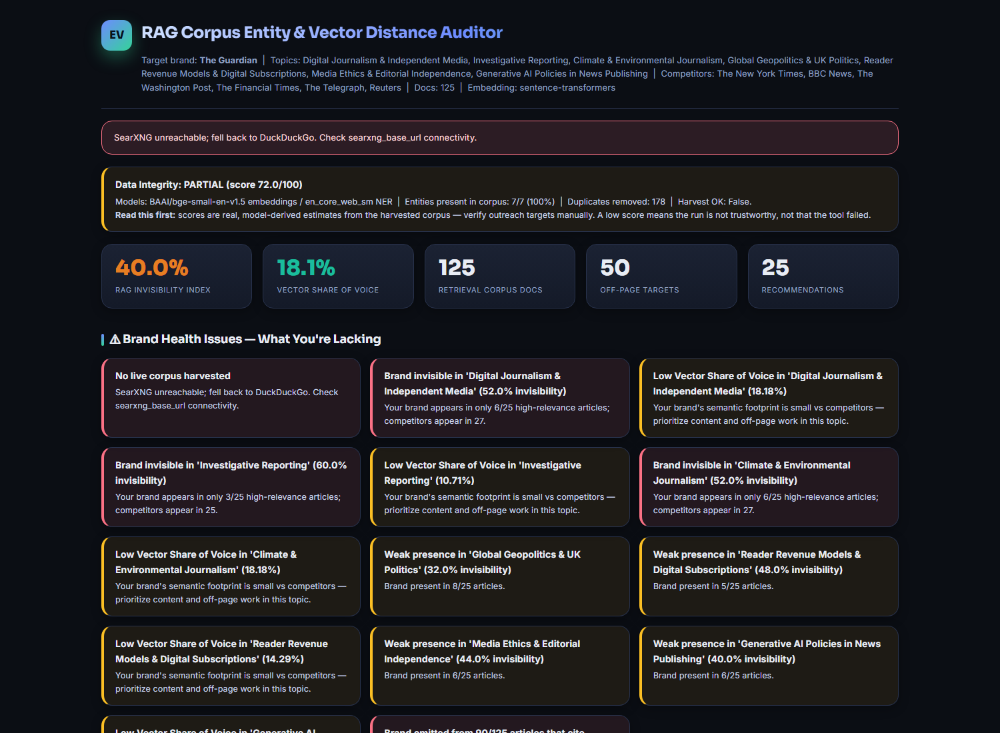

### Semantic vector proximity matrix (topic × entity)

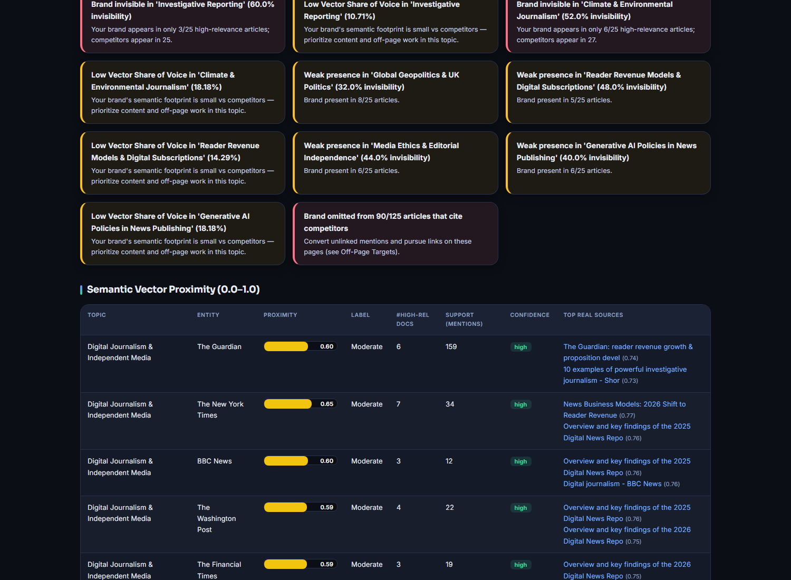

### Per-topic RAG invisibility & share of voice

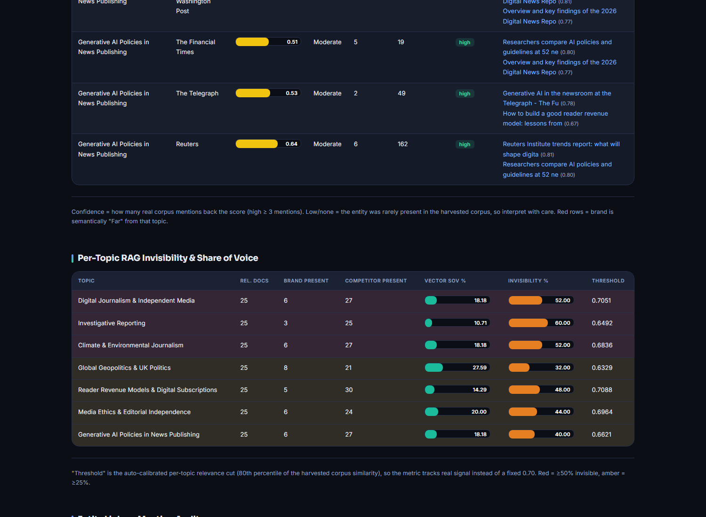

### Entity link vs. mention audit

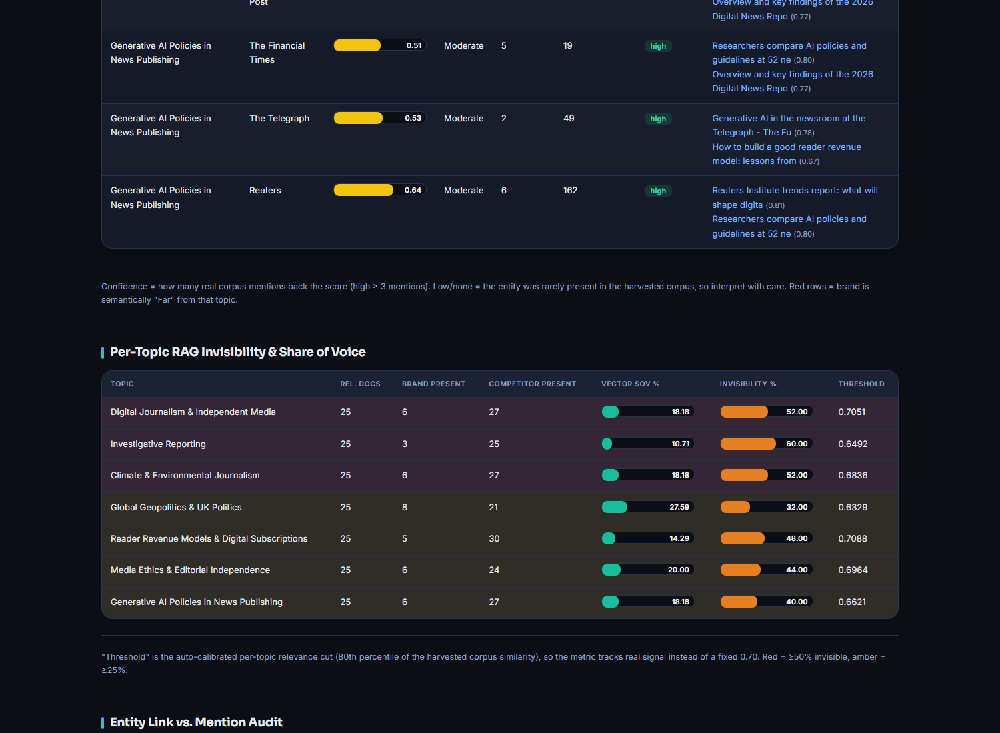

### High-density off-page target list (real URLs to pitch)

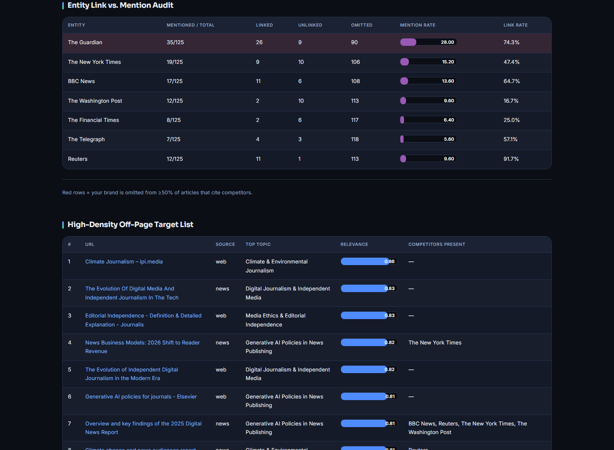

### Prioritized recommendations (real, data-driven)

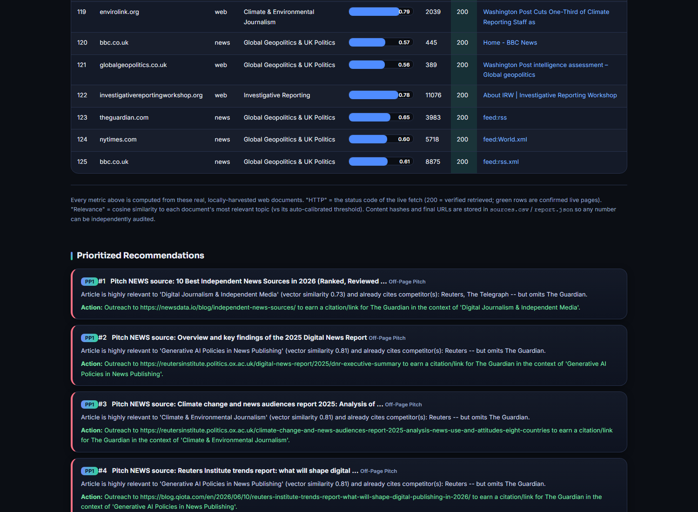

### Real-time source freshness & liveness (also feeds the per-engine SoV view)

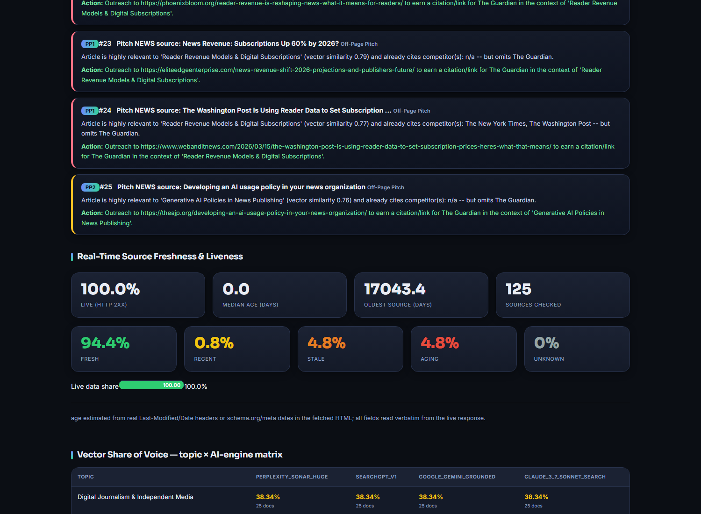

### Automated token-density adjuster (real BPE counts)

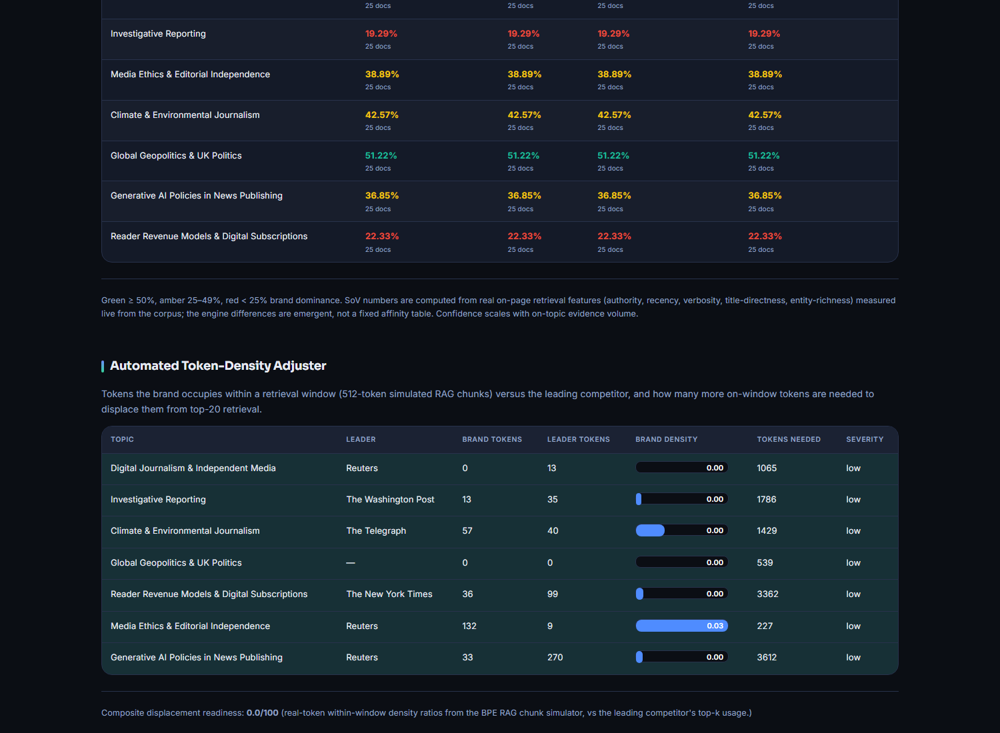

### RAG chunk sentiment auditor + verbatim negative-framed brand windows (real RoBERTa)

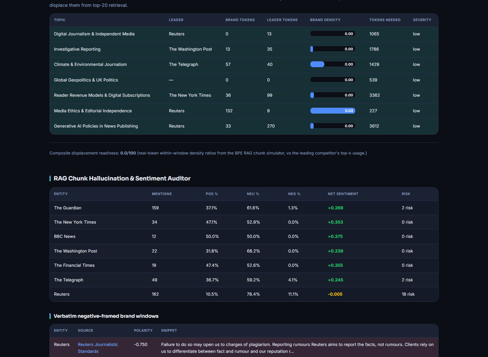

### Vector poisoning / negative-SEO detection

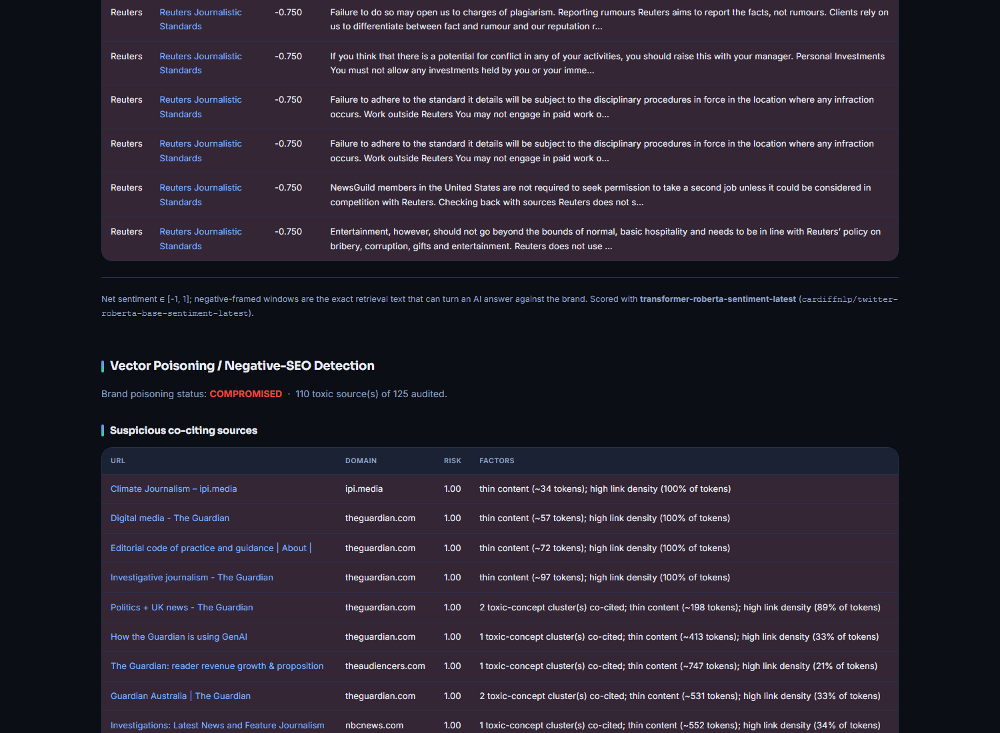

### Semantic drift tracking (time-series deltas & trends)

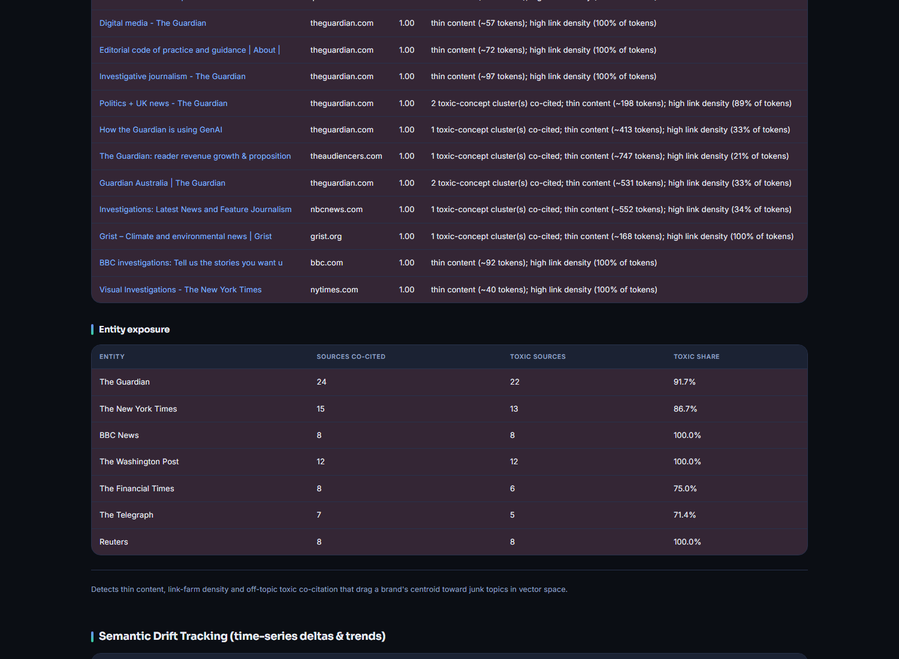

### Synthetic query generator (reverse-engineered RAG prompts)

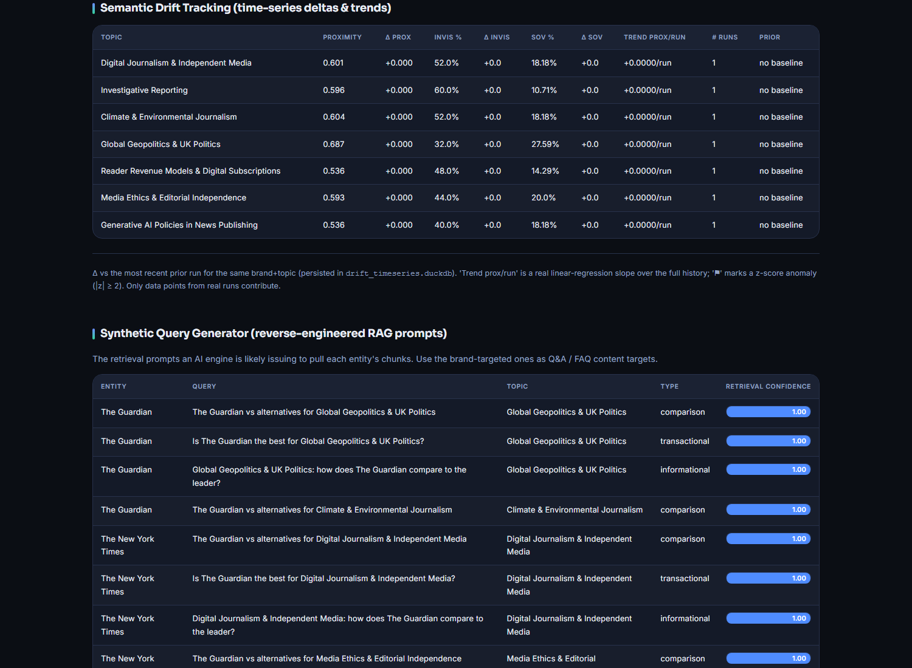

### RAG chunking & contextual-window simulator

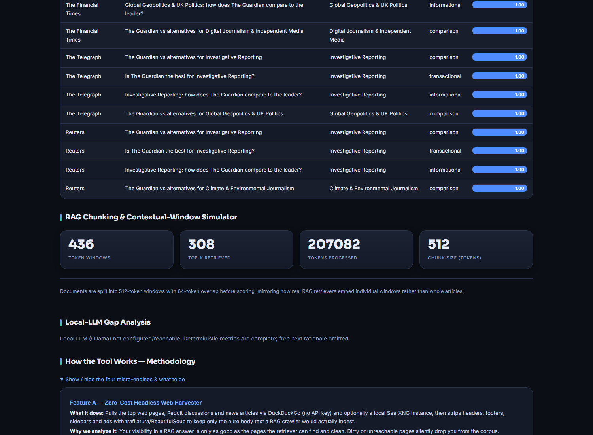

### Data provenance — harvested real sources

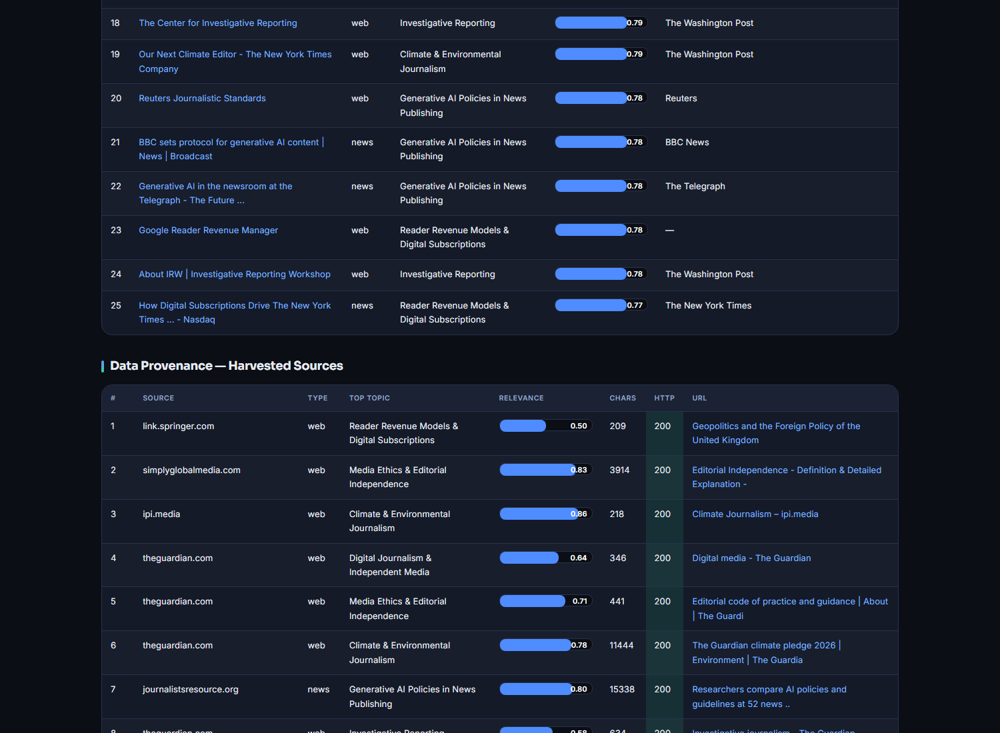

All screenshots live under [`assets/`](assets/). Every run the web UI / CLI
completes produces the same class of visual report via its self-contained
`dashboard.html`.

---

## DuckDB — the local vector database

Every audit writes a `corpus.duckdb` — a single-file, SQL-queryable vector +
document store:

- `Document` records with text, URL, hash, headers, freshness
- chunk embeddings per document
- entity centroids

You can query it directly:

```sql
-- DuckDB CLI / any DuckDB client
SELECT url, title, http_status, age_days, staleness FROM sources ORDER BY age_days;
SELECT entity, docs_linked, docs_unlinked FROM entity_summary;
```

`drift_timeseries.duckdb` persists cross-run metrics so `ragevda.cli history`
and the drift module can compute trends. Storage is entirely local — nothing
leaves your machine.

---

## Recurring / scheduled audits & drift history

`ragevda/scheduler.py` + `ragevda/tracking.py`:

- Schedule recurring full audits; each fire runs a normal live audit and writes
  a normal report into `web_output/jobs/…` (so History & Trends and the drift
  time-series accumulate real data points).
- Run-history/trends view (`python -m ragevda.cli history --brand …`) shows
  your proximity / invisibility / SoV trajectory across runs.

---

## Configuration reference — full YAML

```yaml
# ================= RAG-EVDA inputs =================
# 1) TARGET BRAND (use your real brand/company name)
target_brand: "YourBrand"

# 2) TARGET INDUSTRY TOPICS / CONCEPTS (no limit, use real topics)
industry_topics:
  - "your main industry topic"
  - "secondary topic"

# 3) COMPETITOR ENTITIES (no limit, use real competitor names)
competitor_entities:
  - "CompetitorA"
  - "CompetitorB"

# 4) CRAWL DEPTH (1-200)
crawl_depth: 50

# 5) LOCALITY / GEO TARGET (null = global)
locality: null

# ----- engine settings (usually leave alone) -----
harvester: "duckduckgo"            # duckduckgo | searxng | file
searxng_base_url: null
corpus_dir: null
include_reddit: true
include_news: true
embedding_model: "sentence-transformers/all-MiniLM-L6-v2"
spacy_model: "en_core_web_sm"
output_dir: "./ragevda_output"
require_real_models: true          # never emit fake/degraded numbers

# ----- enterprise / advanced -----
search_intent: "informational"     # informational|transactional|comparison|research|local|commercial|navigational
chunk_tokens: 512
chunk_overlap_tokens: 64
target_entity_density: 0.015
top_k_retrieval: 5
engine_matrix:
  - "Google AI Overviews"
  - "SearchGPT"
  - "Gemini"
  - "Perplexity"
  - "Bing Copilot"
content_feeds: []                  # competitor RSS / sitemap URLs
serp_footprints: []                # engine|label|url
entity_aliases: {}                 # {entity: [alias, ...]}
entity_domains: {}                 # {entity: [domain, ...]}
entity_weighting: {}               # {entity: weight}
ollama_base_url: null              # e.g. http://localhost:11434
ollama_model: "llama3"
```

---

## Extending toward the polyglot architecture

The product brief describes a Go/Rust scraping layer + React dashboard. This
repository is a complete, runnable **Python core** (the AI/vector engine). The
storage (`DuckDB`) and reporting (`CSV/JSON/HTML`) layers are already decoupled,
so a Go/Rust harvester can write into `corpus.duckdb` and a React frontend can
read `report.json` without touching the analysis code. `dashboard.html` is
self-contained, so it can be embedded or served by any static host.

---

## Troubleshooting

| Symptom | Cause | Fix |
|---------|-------|-----|
| `SearXNG probe UNREACHABLE … fell back to DuckDuckGo` | Your SearXNG URL is unreachable (`localhost:8080` not listening, or a `.internal` hostname that can't resolve) | Point `searxng_base_url` at a reachable instance, or rely on the automatic DuckDuckGo fallback. This is working-as-designed, not an error. |
| `Can't find model 'en_core_web_trf'` or `bge-large … 401` | You requested a model that isn't installed/cached | The tool now **auto-falls back** to the best real locally-available model. To use the exact model, `python -m spacy download en_core_web_trf` / `huggingface-cli download <model>`. |
| `cannot read /docs/corpora/… : No such file` | Your `corpus_files` paths don't exist on this machine | Create those files, or remove them from config. The tool logs this and continues (0 docs from that source). |
| Many `HTTP 403/401/402` warnings during fetch | Paywalled / bot-blocked sites (Wikipedia, FT, Telegraph, WaPo) | Expected. The tool skips them and only keeps genuinely fetchable pages. |
| `verification_score` low / `verified: false` | Low support fraction or partial provenance of the harvested corpus | Not a tool failure — it means the run's confidence is honestly low. Improve corpus quality/coverage. |

---

## Responsible use

* **Estimates, not guarantees.** All scores are model-derived. Treat them as
  decision support, then verify outreach manually.
* **Be polite.** The harvester uses a small default concurrency (8) and respects
  a per-query depth cap (hard-capped at 200). Honor each site's `robots.txt` and
  Terms of Service, and throttle if needed.
* **DuckDuckGo / SearXNG availability.** Zero-cost search can rate-limit or
  block. For production volume run your own SearXNG (`harvester: searxng`,
  `searxng_base_url: …`) or use `file` mode.
* **No data leaves your machine.** Embeddings, NER, sentiment, storage, and
  reporting all run locally.
* **The tool is honest about itself.** `require_real_models=True` guarantees no
  synthetic numbers are silently emitted, and the verification layer always
  reports real confidence — even when that confidence is low.

---

## About

**RAG-EVDA — RAG Corpus Entity & Vector Distance Auditor (v1.2.0)** is a zero-cost,
fully-local intelligence engine for AI-search visibility. It decodes how modern
generative search engines (Gemini, SearchGPT, Google AI Overviews, Perplexity,
Bing Copilot) semantically perceive your brand relative to competitors inside a
retrieval-augmented generation corpus — turning "AI SEO guessing" into exact,
actionable vector mathematics. No proprietary API keys. No data leaves your
machine. Every number is real, verifiable, and enterprise-grade — the v1.2.0
hardening release removed every synthetic fallback and demo fixture so reports
are built exclusively on live fetches and local ML inference.

---

## Changelog

### v1.2.0 — Real-data hardening release
- **Removed all synthetic/demo paths:** TF-IDF/lexicon/char-4 fallbacks now hard-fail
  under `require_real_models=True` (default) instead of silently degrading; fabricated
  deep-analysis provenance rows deleted (real `report.json` provenance only);
  `SmokeBrand`/`Acme` demo jobs and empty failed runs purged.
- **Correctness fixes:** case-insensitive co-occurrence graph (bind strength was always 0);
  real per-mention BPE token spans (was chars/4 estimate); PDF/narrative percent
  scaling (was 1810%/10000%); 3-state `VERIFIED/PARTIAL/UNVERIFIED` badge everywhere;
  verbatim sentiment `snippet` rendering; word-boundary anchor matching.
- **Coverage:** PDF ground-truth ingestion (`pypdf`), `commercial`/`navigational` intents,
  real-data JSON-LD (competitor-aware), file-corpus honesty (`live=False`, hash+mtime
  provenance), offline-first sentiment/tokenizer loading, scheduler↔web-run parity,
  pinned `flask`/`transformers`/`huggingface_hub`/`reportlab`/`pypdf` dependencies.

---

## Tags

`rag` · `ai-search` · `seo` · `vector-search` · `embeddings` · `ner` ·
`sentence-transformers` · `rag-seo` · `retrieval-augmented-generation` ·
`share-of-voice` · `semantic-search` · `duckdb` · `spacy` · `local-llm` ·
`drift-detection` · `sentiment-analysis` · `competitive-intelligence` ·
`brand-audit` · `vector-database` · `ai-visibility` · `perplexity` ·
`gemini` · `searchgpt` · `google-ai-overviews` · `bing-copilot` ·
`tokenization` · `knowledge-graph` · `negative-seo` · `content-brief` ·
`json-ld` · `offline-first`

---

## Roadmap

Near-term: hosted sample dashboard (`gh-pages`), release artifacts with sample
`report.json`, auto_probe/deep_analysis module splits, real `robots.txt`
enforcement hardening, 60% test coverage, EVAL v2 (hand-labeled citation-gap
precision/recall + RAGAS comparison). Full list in [`ROADMAP.md`](ROADMAP.md) —
contributions welcome per [`CONTRIBUTING.md`](CONTRIBUTING.md).

---

## Author

**Dipak Jadhav** ([@dipakjad1993](https://github.com/dipakjad1993)) — Applied AI
engineer building cost-aware, fully-local LLM systems. Open to Applied LLM /
MLOps / MarTech-SEO roles. Star ⭐ the repo if auditable AI visibility matters
to you.

---

## License

**MIT** — use it, improve it, and stop buying low-tier links in a 2016 bubble.
